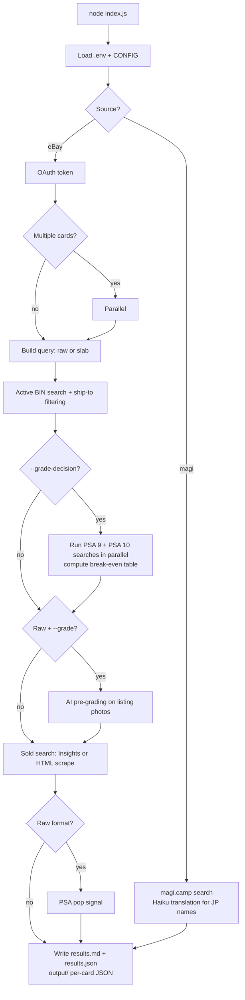

# Casecomp

**Casecomp** is a card research tool for collectors. Ask it for a card in plain English — `/casecomp Umbreon ex 217/187 PSA 10 japanese` — and it pulls live listings from eBay and magi.camp, recent sold comps, and (for raw searches) a PSA grading signal showing difficulty, 10 chance, and population. Results land in a clean markdown table with prices, shipping costs, and clickable links.

Results are written to **`results.md`** (human-readable) and **`results.json`** (full data). Every run also appends to **`output/resultsCombined.md`** — a deduplicated running log across all searches.


---

## Using with Claude Code (`/casecomp`) — no terminal experience needed

If you have [Claude Code](https://claude.ai/claude-code) installed, you can search for cards by typing plain English instead of CLI flags. This section walks you through setup from scratch.

### One-time setup

1. **Install Node.js 20+** — download from [nodejs.org](https://nodejs.org/) and run the installer.
2. **Install Claude Code** — follow the instructions at [claude.ai/claude-code](https://claude.ai/claude-code). It works as a CLI in your terminal, a desktop app, or an IDE extension.
3. **Clone or download this project** and open a terminal in the project folder.
4. **Install dependencies** — run:
   ```
   npm install
   npx playwright install chromium
   ```
5. **Set up your eBay API keys:**
   - Go to [developer.ebay.com](https://developer.ebay.com/) and create a free account.
   - Create an application to get a **Client ID** and **Client Secret**.
   - Copy `.env.example` to `.env` and paste your keys:
     ```
     EBAY_CLIENT_ID=your-client-id-here
     EBAY_CLIENT_SECRET=your-client-secret-here
     ```
6. **Start Claude Code** in this project folder (run `claude` in the terminal, or open the folder in the desktop app).

### How to search

Once Claude Code is running in this project, just type `/casecomp` followed by what you want to find. Write it like you'd tell a friend — Claude figures out the flags.

**Examples:**

| You type | What happens |
|----------|--------------|
| `/casecomp Giratina V Alt Art` | Searches eBay for raw (ungraded) listings, 5 results + 5 sold |
| `/casecomp Pikachu VMAX PSA 10` | Searches for PSA 10 graded slabs |
| `/casecomp charizard ex BGS 9.5 japanese, 10 results` | Japanese BGS 9.5 slabs, 10 active results |
| `/casecomp compare Umbreon VMAX alt art and Espeon VMAX alt art` | Searches both cards **in parallel** (faster!) |
| `/casecomp Mew ex, ship to UK only, last 15 solds` | Ships to UK, 15 recent sold comps |
| `/casecomp should I grade Team aqua's kyogre ex japanese?` | Grading decision — shows PSA break-even table by submission tier |
| `/casecomp fresh search for Rayquaza V alt art` | Clears cache and fetches new data |

Claude will show you a confirmation line before searching, then display a formatted table with prices, shipping, and clickable links.

### What you get back

For **raw searches**, a grading signal panel appears above the listings using live PSA pop report data:

| Difficulty | PSA 10 Chance | Population | PSA 9/10 |
|:----------:|:-------------:|:----------:|:--------:|
| **Hard** | 3.2% | 1,204 | 0.87 : 1 |

Then the active listings table (sources labelled eBay or magi):

| # | Total | Ship | To | Grade | Title | Link |
|---|------:|------|-------|-------|------|------|
| 1 | $619.99 | free | US:19701 IN:600028 | PSA 10 | Umbreon ex SAR 217/187 2024 Pokemon Terastal Festival sv8a Alt Art PSA 10 | [eBay](https://www.ebay.com/itm/318161356194) |
| 2 | $664.71 | — | US:19701 IN:600028 | PSA 10 | 【PSA10】ブラッキーex SAR 217/187 1枚 | [magi](https://magi.camp/items/472702272) |
| 3 | $810.00 | $10.00 | US:19701 IN:600028 | — | TAG GEM MINT 10 UMBREON EX 2024 POKÉMON SCARLET & VIOLET JAPANESE #217/187 | [eBay](https://www.ebay.com/itm/376058718185) |

Plus a recent sold table so you can see what cards actually sell for, not just what sellers are asking:

| # | Price | Date | Grade | Title | Link |
|---|------:|------|-------|-------|------|
| 1 | $750.00 | Apr 30, 2026 | PSA 10 | Umbreon EX 217/187 Special Art Rare Pokemon Japanese PSA 10 | [eBay](https://www.ebay.com/itm/406891668625) |
| 2 | $673.54 | — | PSA 10 | 【PSA10】ブラッキーex SAR 217/187 1枚 | [magi](https://magi.camp/items/597154378) |
| 3 | $749.00 | Apr 22, 2026 | TAG 10 | TAG GEM MINT 10 UMBREON EX 2024 POKÉMON SCARLET & VIOLET JAPANESE #217/187 | [eBay](https://www.ebay.com/itm/366361136416) |

**Price trend (sold):** 5d: +25.0% | 15d: -0.3% | 30d: -11.8%

The price trend line compares the most recent sale to the closest sale ~5, 15, and 30 days ago, so you can spot whether a card is trending up or down.

With `--grade-decision`, a break-even table appears before the listings showing whether submitting for grading is worth it at current comps:

**Grading Decision** (PSA submission analysis)

Raw ask median: $415.31 | PSA 9 sold avg: $445.79 | PSA 10 sold avg: $742.19

| Tier | Fee | Net PSA 9 | Upside | Net PSA 10 | Upside |
|------|----:|----------:|-------:|-----------:|-------:|
| Economy | $25 | $421.00 | +1% | $717.00 | +73% |
| Regular | $50 | $396.00 | -5% | $692.00 | +67% |
| Express | $150 | $296.00 | -29% | $592.00 | +43% |
| Super Express | $300 | $146.00 | -65% | $442.00 | +6% |
| Walk-through | $600 | $-154.00 | -137% | $142.00 | -66% |

_Net = median sold − submission fee. Upside vs raw median ask._

---

## Requirements

- **Node.js 20+**
- An **eBay developer** keyset ([developer.ebay.com](https://developer.ebay.com/))

---

## Quick start (CLI)

```bash
npm install
cp .env.example .env        # set EBAY_CLIENT_ID and EBAY_CLIENT_SECRET
npm start                    # runs default cards in index.js
```

Override cards on the fly: `node index.js "Charizard ex" "Pikachu VMAX"`

---

## Common flags

| Flag | Example | What it does |
|------|---------|--------------|
| `--format` | `slab` / `raw` | Graded slab search vs ungraded raw (default: `raw`) |
| `--slab-provider` | `PSA`, `BGS`, `CGC`, `TAG` | Grading company for slab mode |
| `--slab-grade` | `10`, `9.5` | Grade number for slab mode |
| `--lang` | `eng`, `jp`, `eng,jp` | Filter by card language |
| `--countries` | `US,IN`, `US,GB` | Ship-to countries (default: `US,IN`) |
| `--sold` | `10` | Number of recent sold comps (default: `5`) |
| `--results` | `10` | Active listings per card (default: `5`) |
| `--grade` | *(flag)* | AI pre-grading on raw listings |
| `--refresh` | *(flag)* | Clear caches and fetch fresh data |
| `--source` | `magi` | Force magi.camp as the listing source instead of eBay |
| `--output` | `results-psa` | Output file prefix (default: `results`) |
| `--merge` | `results-psa,results-tag` | Merge per-card JSON files from multiple runs into one output |
| `--parallel` | *(flag)* | Search multiple cards concurrently |
| `--grade-decision` | *(flag)* | Run raw + PSA 9 + PSA 10 searches in parallel and show a break-even table by submission tier |

Full flag list, raw vs slab details, and example commands: **[docs/cli-reference.md](docs/cli-reference.md)**

---

## Multi-source and multi-provider searches

You can run the same cards against **multiple grading providers** (e.g. PSA and TAG) and then merge the results into a single `results.md`:

```bash
node index.js --refresh --lang jp --format slab --slab-provider PSA --output results-psa "Umbreon ex 217/187"
node index.js --refresh --lang jp --format slab --slab-provider TAG --output results-tag "Umbreon ex 217/187"
node index.js --merge results-psa,results-tag
```

You can also mix **eBay and magi.camp** sources the same way — run each separately with `--output` prefixes, then merge.

Per-card JSON files are written to `output/` so they don't clutter the project root. The final `results.md` and `results.json` always land in the root.

---

## Grading Decision

`--grade-decision` answers "should I grade this raw card?" by running three searches in parallel — raw, PSA 9, and PSA 10 — and computing a break-even table across every PSA submission tier:

```
/casecomp "Team aqua's kyogre ex 006/034" japanese --grade-decision
```

Net = median sold − submission fee. Upside vs raw median ask. Negative rows flag tiers where the submission fee exceeds the grade uplift.

Tip: include the set number in the card name (e.g. `006/034`) to avoid variant mixing in the sold comps.

---

## PSA Grading Signal

For raw (ungraded) card searches, the tool automatically fetches pop report data from the [PSA public API](https://api.psacard.com/publicapi) and displays a grading signal panel:

- **Difficulty** — Brutal / Hard / Moderate / Easy based on the % of cards that grade PSA 10
- **PSA 10 Chance** — percentage of submitted cards that received a 10
- **Population** — total cards graded
- **PSA 9/10 ratio** — how many 9s exist for every 10 (higher = many near-misses)

The anonymous tier allows 100 requests/day and results are cached for 24 hours. For higher quota, set `PSA_AUTH_TOKEN` in `.env`.

---

## How it works



---

## Environment

Copy `.env.example` to `.env`. Only two variables are required:

```
EBAY_CLIENT_ID=your-client-id
EBAY_CLIENT_SECRET=your-client-secret
```

| Variable | Required | Purpose |
|----------|----------|---------|
| `EBAY_CLIENT_ID` | Yes | eBay Browse API |
| `EBAY_CLIENT_SECRET` | Yes | eBay Browse API |
| `ANTHROPIC_API_KEY` | For `--grade` (Claude) | AI pre-grading |
| `OPENAI_API_KEY` | For `--grade` (OpenAI) | AI pre-grading |
| `ANTHROPIC_HAIKU_KEY` | For magi.camp | Translates English card names to Japanese (uses claude-haiku-4-5) |
| `PSA_AUTH_TOKEN` | Optional | Higher quota for PSA pop report (anonymous = 100 req/day) |

Full list: **[docs/env-vars.md](docs/env-vars.md)**

---

## Project layout, caches, and internals

See **[docs/internals.md](docs/internals.md)** for file descriptions, cache TTLs, and configuration details.

---

## Disclaimer

AI "grades" are **rough estimates from photos**, not official PSA/CGC/etc. grades. Use them only as a screening hint. Respect eBay's [API terms](https://developer.ebay.com/join/api-license-agreement) and rate limits.
