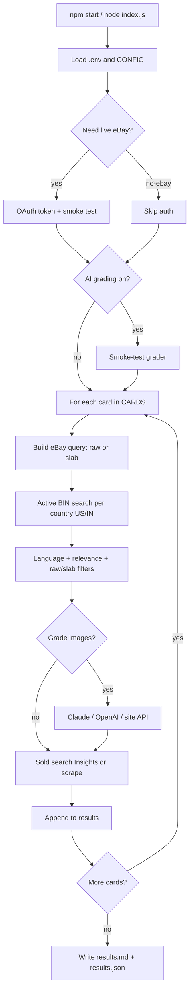

# eBay Pokémon card search

A small Node.js tool that searches the [eBay Browse API](https://developer.ebay.com/api-docs/buy/browse/static/overview.html) for Pokémon cards from a list you define, finds **lowest fixed-price (BIN) listings** with **US / India delivery** filters, pulls **recent sold** prices (Marketplace Insights when allowed, otherwise HTML fallback), and optionally runs **AI pre-grading** on listing photos.

Results are written to **`results.md`** (human-readable) and **`results.json`** (full data).

---

## Requirements

- **Node.js 20+**
- An **eBay developer** keyset ([developer.ebay.com](https://developer.ebay.com/)) unless you use `--no-ebay` (cache-only / no live API).

---

## Quick start

```bash
cd /path/to/dev
npm install
cp .env.example .env
# Edit .env: set EBAY_CLIENT_ID and EBAY_CLIENT_SECRET
npm start
```

Default run uses **`CARDS`** and **`CONFIG`** in [`index.js`](index.js). You can override the card lines with **positional arguments** (`npm start -- "Card A" "Card B"`) or **`--cards`**; if you omit both, the script uses `CARDS`. Other behavior is overridden with CLI flags (see below).

---

## What happens when you run it (command flow)



In plain steps:

1. **Environment** — Loads `.env`. If eBay keys are missing and you did not pass `--no-ebay`, the script prints setup help and exits.
2. **eBay** — Gets an OAuth token (cached in memory until expiry). Refreshes on `401`.
3. **Grading (optional)** — If enabled, runs one test image through your chosen provider; on failure, grading is turned off so the rest of the run still completes.
4. **Each card** — Builds the eBay `q` string (see **Raw vs slab**), fetches active listings per delivery country, filters, optionally grades, then fetches sold listings.
5. **Output** — Merges everything into `results.md` and `results.json`.

---

## Configure the card list and defaults

Edit **`index.js`**:

- **`CARDS`** — Default search phrases when you don’t pass card lines on the CLI (the script builds the final eBay `q`).
- **`CONFIG`** — Language (`any`, or **`eng+jp`** joins), **`languages`**, **`deliveryCountries`** (buyer destinations `US`, `IN`, …), **`resultsPerCard`** / **`soldListingsLimit`**, **raw vs slab**, AI grading. Active search uses **one shared BIN Browse pool** (no `deliveryCountry` filter), then **`getItem` `shipToLocations`** and optional HTML “Doesn’t ship to” parsing to drop rows that exclude that buyer country.

**CLI card lines:** non-flag positional args (`node index.js -- "Charizard V"` …) plus **`--cards "A,B,C"`** if you prefer comma-separated. Order is positional first, then `--cards`; duplicates are kept. Omit both to use `CARDS`.

CLI flags override `CONFIG` for that run (see next section).

---

## CLI reference

| Flag | What it does |
|------|----------------|
| *(positional)* | One or more card search lines after flags, e.g. `npm start -- --format slab "Pikachu vmax"` |
| `--cards` | Comma-separated card lines (merged after any positional cards). If neither this nor positional args are set, **`CARDS`** in `index.js` is used. |
| `--lang` | **Single:** `any` \| `eng` \| `jp` \| `cn` (**aliases:** `en` / `English`; `Japanese`; `Chinese` / `CN`). **Multiple:** comma / semicolon / pipe, or repeat the flag (`--lang eng --lang jp` → **`eng+jp`** in logs/JSON); unknown tokens logged and dropped. **`any`** in the mix clears narrowing. With TCG singles category (**183454**), active search uses **`Language:{English|Japanese|…}`** on Browse. **Sold (when narrowed):** `getItem` keeps listings whose Language facet matches **one of** the selected langs; **`--lang any`** skips extra `getItem` work. |
| `--countries` | Comma-separated **buyer ship-to** ISO codes (e.g. `US,IN`). Not a Browse `deliveryCountry` filter — each listing is checked with **Browse `getItem`** (`shipToLocations`) and, when needed, a light HTML probe for “Doesn’t ship to …”. |
| `--results` | Max active rows **per destination** after ship-to filtering |
| `--sold` | How many recent sold rows to keep |
| `--sold-browser` | Prefer **Playwright (Chromium)** for sold HTML when Marketplace Insights is unavailable (then axios). Requires `npx playwright install chromium` once. |
| `--format` | `raw` or `slab` (see below) |
| `--slab-provider` | Grader label for slab mode, e.g. `PSA`, `BGS`, `CGC` |
| `--slab-grade` | Grade string, e.g. `10`, `9.5` |
| `--raw-suffix` | Extra words appended to eBay `q` in non-slab mode (default: none — card name only) |
| `--grade` | Turn on AI pre-grading (**no effect** with **`--format slab`**) |
| `--grade-mode` | `llm` or `site` |
| `--llm-provider` | `claude` or `openai` |
| `--llm-model` | Model id, e.g. `claude-opus-4-7`, `gpt-4o` |
| `--site-provider` | `tcgrader`, `pokegrade`, `snapgrade`, `local` |
| `--min-grade` | Drop graded rows below this predicted overall (after grading) |
| `--refresh` | Delete eBay + AI grade cache files and refetch |
| `--limit` | Only process the first **N** card lines (**after** resolving CLI positional / `--cards` vs `CARDS`) |
| `--no-ebay` | Do not call eBay (uses cache if present; see note below) |

**Note:** This project uses **minimist**. The flag `--no-ebay` is parsed as `{ ebay: false }`, which the script treats as “skip eBay.” Use **`--no-ebay`** exactly like that.

---

## Raw vs slab searches

| Mode | eBay query shape | Extra filtering |
|------|------------------|-----------------|
| **raw** | `{card}` plus optional `rawSearchSuffix` (default: no extra words) | Drops titles that look like graded slabs (PSA/BGS/CGC-style). |
| **slab** | `{card} {provider} {grade}` | Keeps titles that plausibly mention that grader + grade. **`--grade` / AI pre-grade is ignored** (listing already claims a slab grade). |

Examples:

```bash
# Non-slab / raw mode (eBay q is just the card line unless you add --raw-suffix)
npm start -- --format raw

# Raw, custom keywords in the eBay query
npm start -- --format raw --raw-suffix "ungraded nm"

# Slab: CGC 9.5
npm start -- --format slab --slab-provider CGC --slab-grade 9.5

# Slab: PSA 10
npm start -- --format slab --slab-provider PSA --slab-grade 10
```

Fuzzy **relevance** (keywords, Pokémon name, blocklist) uses the **card line** (`CARDS`, positional args, or `--cards`), not the slab tokens appended to `q`, so matching stays centered on the card name.

---

## Example commands

```bash
# Baseline: US + India, English-only, 5 BIN + 3 sold per card
npm start -- --lang eng --countries US,IN --results 5 --sold 3

# Aliases (--lang normalized to canonical eng/jp/cn)
npm start -- --lang English --results 10 "Charizard V"

# Multiple languages (OR on facet / sold getItem — English OR Japanese listings)
npm start -- --lang eng,jp --results 5 "Pikachu promo"
npm start -- --lang chinese "Pokemon Pikachu"
npm start -- --lang jp --format slab --slab-provider PSA --slab-grade 10 "Rayquaza V AA"

# Same, but sold comps via browser when Insights is not available (install browsers first: npm run playwright-install)
npm start -- --lang eng --countries US,IN --results 5 --sold 3 --sold-browser

# Card lines from CLI (override `CARDS` in index.js)
npm start -- --format slab --slab-provider PSA --slab-grade 10 "Giratina V Alt Art Japanese"

# Or comma-separated
npm start -- --cards "Pikachu vmax,Charizard ex"

# First card line only when you pass several
npm start -- --limit 1 "Card A" "Card B"

# Refresh all caches
npm start -- --refresh

# LLM grading with Claude
npm start -- --grade --grade-mode llm --llm-provider claude --llm-model claude-opus-4-7

# LLM grading with OpenAI
npm start -- --grade --grade-mode llm --llm-provider openai --llm-model gpt-4o

# Site / self-hosted grader
npm start -- --grade --grade-mode site --site-provider local

# Keep only listings whose AI overall grade is at least 8
npm start -- --grade --min-grade 8

# No live eBay (empty output unless you already have cache files)
npm start -- --no-ebay --limit 1
```

---

## Environment variables

Copy **`.env.example`** to **`.env`**. Summary:

| Variable | When needed |
|----------|-------------|
| `EBAY_CLIENT_ID`, `EBAY_CLIENT_SECRET` | Always for live eBay (unless `--no-ebay`) |
| `EBAY_API_BASE` | Optional. Defaults to **`https://api.ebay.com`** (production). Use `https://api.sandbox.ebay.com` only with sandbox keysets. |
| `EBAY_OAUTH_SCOPE` | Optional. Defaults to **Browse-only** scope (works with normal keysets). Add Marketplace Insights scope only if eBay approved your app; otherwise sold data uses HTML fallback. |
| `EBAY_TRY_INSIGHTS_SCOPE` | Optional. Set to `1` to request Insights on the token (same as adding the Insights URL to `EBAY_OAUTH_SCOPE`); token falls back to Browse-only if eBay returns `invalid_scope`. If the Issued token includes Insights, the sold pipeline may call Insights; otherwise HTML scrape is used (no doomed 403 on Browse-only tokens). |
| `EBAY_SKIP_MARKETPLACE_INSIGHTS` | Optional. `1` / `true` — never calls Marketplace Insights (HTML sold scrape only), even when your env requests the Insights scope. |
| `EBAY_SOLD_BROWSER` | Optional. `1` / `true` / `playwright` — same as `--sold-browser` (sold HTML via Chromium when Insights is unavailable). |
| `EBAY_INSIGHTS_SORT` | Optional. Rarely needed. The Insights `item_sales/search` call does **not** use Browse `sort` values; leave unset unless eBay documents a valid sort for your access level. |
| `EBAY_BROWSE_CATEGORY_IDS` | Optional. Defaults to **`183454`**: breadcrumb **Toys & Hobbies › Collectible Card Games › Single Cards** (Buy API leaf name *CCG Individual Cards*). Comma-separated IDs for Browse `category_ids`. |
| `EBAY_BROWSE_CONTEXT_COUNTRY` | Optional. Default **`US`**. Passed as `X-EBAY-C-ENDUSERCTX` contextual location for Browse sort/price (not the same as ship-to). |
| `EBAY_SHIP_LOOKUP_MAX_POOL` | Optional. Cap (default **96**) on how many cheapest qualifying listings are considered before per-listing ship **getItem** calls. |
| `EBAY_ACTIVE_SHIP_GETITEM_CAP` | Optional. Max **getItem** calls per card for ship-to refinement (default **64**). |
| `EBAY_ACTIVE_ITEM_FIELDGROUPS` | Optional. Browse `getItem` `fieldgroups` for ship lookup (default **`EXTENDED`**). |
| `ANTHROPIC_API_KEY` | `--grade` with `--llm-provider claude` |
| `OPENAI_API_KEY` | `--grade` with `--llm-provider openai` |
| `LOCAL_GRADER_URL` | Site mode with `--site-provider local` |
| `TCGRADER_*`, `POKEGRADE_*`, `SNAPGRADE_*` | Matching site providers |

If sold comps always show **`http`** / **`playwright`** / **`scrape`**, that is normal: default OAuth scopes are **Browse-only**, so Insights is intentionally skipped until you configure `buy.marketplace.insights`, get the token granted with that scope, and have eBay’s **restricted-API approval** — otherwise Insights returns HTTP **403** (“Insufficient permissions”). One-time `[sold]` log lines explain skips; `--refresh` also clears **`ebay-insights-forbidden-cache.json`** when you retry after gaining access.

If Insight calls fail with **`[insights]`** plus **HTTP 4xx/5xx** while probing, permissions or params are wrong. **`[insights]` 0 rows** means the call succeeded but returned no comps.

Read eBay Marketplace Insights docs (Limited Release): https://developer.ebay.com/api-docs/buy/marketplace-insights/static/overview.html

---

## Outputs and cache files

| Output / file | Purpose |
|---------------|---------|
| `results.md` | Tables: active per `--countries` destination, sold list, grading disclaimer |
| `results.json` | Full structured payload + `cardQueries` (resolved list) + config snapshot |
| `ebay-active-cache.json` | Cached active searches (6h TTL by default) |
| `ebay-sold-cache.json` | Cached sold searches (24h) |
| `ebay-insights-forbidden-cache.json` | Written after Marketplace Insights HTTP 403 — suppresses Insight retries ~14 days (also removed by `--refresh`) |
| `ai-grade-cache.json` | Cached AI grades (30d, key includes model/provider) |
| `ebay-usage.json` | Rough daily eBay call counter (logged vs 5000/day cap) |

Use **`--refresh`** to delete those JSON cache files (including the Insights 403 cooldown file) before a run.

---

## Project layout

| File | Role |
|------|------|
| `index.js` | `CARDS`, `CONFIG`, CLI (positional / `--cards` card lines), main loop |
| `ebayCategories.js` | US category id for **Single Cards** (breadcrumb) = **183454** (`CCG Individual Cards` in API docs) |
| `ebay.js` | OAuth, Browse search, Insights + sold scrape fallback |
| `filters.js` | Language, relevance, raw/slab title filters |
| `listingQuery.js` | Builds eBay `q` for raw vs slab |
| `grading.js` | LLM + site grading adapters, cache, throttling |
| `output.js` | `results.md` / `results.json` |
| `cache.js` | Shared cache helpers |

---

## Disclaimer

AI “grades” are **rough estimates from photos**, not official PSA/CGC/etc. grades. Use them only as a screening hint. Respect eBay’s [API terms](https://developer.ebay.com/join/api-license-agreement) and rate limits.
