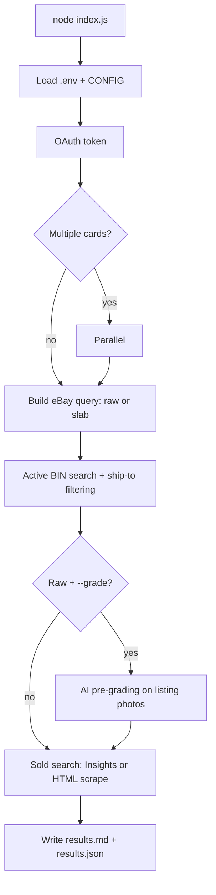

# eBay Pokémon card search

A small Node.js tool that searches the [eBay Browse API](https://developer.ebay.com/api-docs/buy/browse/static/overview.html) for Pokémon cards from a list you define, finds **lowest fixed-price (BIN) listings** with **US / India delivery** filters, pulls **recent sold** prices (Marketplace Insights when allowed, otherwise HTML fallback), and optionally runs **AI pre-grading** on listing photos.

Results are written to **`results.md`** (human-readable) and **`results.json`** (full data).

---

## Using with Claude Code (`/casecomp`) — no terminal experience needed

If you have [Claude Code](https://claude.ai/claude-code) installed, you can search for cards by typing plain English instead of CLI flags. This section walks you through setup from scratch.

### One-time setup

1. **Install Node.js 20+** — download from [nodejs.org](https://nodejs.org/) and run the installer.
2. **Install Claude Code** — follow the instructions at [claude.ai/claude-code](https://claude.ai/claude-code). It works as a CLI in your terminal, a desktop app, or an IDE extension.
3. **Clone or download this project** and open a terminal in the project folder.
4. **Install dependencies** — run:
   ```
   npm install
   npx playwright install chromium
   ```
5. **Set up your eBay API keys:**
   - Go to [developer.ebay.com](https://developer.ebay.com/) and create a free account.
   - Create an application to get a **Client ID** and **Client Secret**.
   - Copy `.env.example` to `.env` and paste your keys:
     ```
     EBAY_CLIENT_ID=your-client-id-here
     EBAY_CLIENT_SECRET=your-client-secret-here
     ```
6. **Start Claude Code** in this project folder (run `claude` in the terminal, or open the folder in the desktop app).

### How to search

Once Claude Code is running in this project, just type `/casecomp` followed by what you want to find. Write it like you'd tell a friend — Claude figures out the flags.

**Examples:**

| You type | What happens |
|----------|--------------|
| `/casecomp Giratina V Alt Art` | Searches for raw (ungraded) listings, default 5 results + 3 sold |
| `/casecomp Pikachu VMAX PSA 10` | Searches for PSA 10 graded slabs |
| `/casecomp charizard ex BGS 9.5 japanese, 10 results` | Japanese BGS 9.5 slabs, 10 active results |
| `/casecomp compare Umbreon VMAX alt art and Espeon VMAX alt art` | Searches both cards **in parallel** (faster!) |
| `/casecomp Mew ex, ship to UK only, last 15 solds` | Ships to UK, 15 recent sold comps |
| `/casecomp fresh search for Rayquaza V alt art` | Clears cache and fetches new data |

Claude will show you a confirmation line before searching, then display a formatted table with prices, shipping, and clickable eBay links.

### What you get back

A table for each card showing active listings:

| # | Total | Ship | To | Grade | Title |
|---|-------|------|----|-------|-------|
| 1 | $619.99 | free | US:✓ IN:✓ | PSA 10 | [Umbreon ex SAR 217/187 2024 Pokemon T...](https://www.ebay.com/itm/318161356194) |
| 2 | $650.00 | free | US:✓ IN:✓ | PSA 10 | [Umbreon EX SAR 217/187 Terastal Festi...](https://www.ebay.com/itm/146631348454) |

Plus a recent sold table so you can see what cards actually sell for, not just what sellers are asking:

| # | Price | Date | Title |
|---|-------|------|-------|
| 1 | $797.00 | Apr 24, 2026 | [PSA 10 Umbreon ex SAR 217/187 Terasta...](https://www.ebay.com/itm/405443771260) |
| 2 | $725.00 | Apr 16, 2026 | [PSA 10 Pokemon Card Umbreon ex SV8a 2...](https://www.ebay.com/itm/227291025974) |

**Price trend (sold):** 5d: +9.9% | 15d: +9.9% | 30d: +22.6%

The price trend line compares the most recent sale to the closest sale ~5, 15, and 30 days ago, so you can spot whether a card is trending up or down.

---

## Requirements

- **Node.js 20+**
- An **eBay developer** keyset ([developer.ebay.com](https://developer.ebay.com/))

---

## Quick start (CLI)

```bash
npm install
cp .env.example .env        # set EBAY_CLIENT_ID and EBAY_CLIENT_SECRET
npm start                    # runs default cards in index.js
```

Override cards on the fly: `node index.js “Charizard ex” “Pikachu VMAX”`

---

## Common flags

| Flag | Example | What it does |
|------|---------|--------------|
| `--format` | `slab` / `raw` | Graded slab search vs ungraded raw (default: `raw`) |
| `--slab-provider` | `PSA`, `BGS`, `CGC` | Grading company for slab mode |
| `--slab-grade` | `10`, `9.5` | Grade number for slab mode |
| `--lang` | `eng`, `jp`, `eng,jp` | Filter by card language |
| `--countries` | `US,IN`, `US,GB` | Ship-to countries (default: `US,IN`) |
| `--sold` | `10` | Number of recent sold comps (default: `3`) |
| `--results` | `10` | Active listings per country (default: `5`) |
| `--grade` | *(flag)* | AI pre-grading on raw listings |
| `--refresh` | *(flag)* | Clear caches and fetch fresh data |

Full flag list, raw vs slab details, and example commands: **[docs/cli-reference.md](docs/cli-reference.md)**

---

## How it works



---

## Environment

Copy `.env.example` to `.env`. Only two variables are required:

```
EBAY_CLIENT_ID=your-client-id
EBAY_CLIENT_SECRET=your-client-secret
```

For AI grading, add `ANTHROPIC_API_KEY` or `OPENAI_API_KEY`. Full list: **[docs/env-vars.md](docs/env-vars.md)**

---

## Project layout, caches, and internals

See **[docs/internals.md](docs/internals.md)** for file descriptions, cache TTLs, and configuration details.

---

## Disclaimer

AI “grades” are **rough estimates from photos**, not official PSA/CGC/etc. grades. Use them only as a screening hint. Respect eBay’s [API terms](https://developer.ebay.com/join/api-license-agreement) and rate limits.
