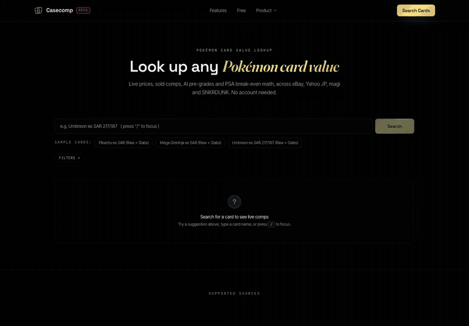

#  Casecomp

[](CHANGELOG.md)
[](https://github.com/Pyronewbic/casecomp/actions/workflows/test.yml)
[](LICENSE)
[](https://api.casecomp.xyz/docs)

**[casecomp.xyz](https://casecomp.xyz)** | **[API Docs](https://api.casecomp.xyz/docs)** | **[Dashboard](https://api.casecomp.xyz/dashboard)** | **[Admin](https://api.casecomp.xyz/admin)** | **[Changelog](CHANGELOG.md)**

Search any Pokemon card across four marketplaces in one query. Get live prices, AI condition estimates, and PSA grading signals — instead of manually checking eBay, magi.camp, Yahoo Auctions, and SNKRDUNK separately.



### Features

- **Multi-source search** — eBay, magi.camp, Yahoo Auctions JP, SNKRDUNK in one query
- **Cross-source arbitrage** — compares lowest prices across sources, highlights spread
- **Condition detection** — auto-detects card condition across sources (EN: NM/LP/MP, JP: 状態A/美品)
- **AI pre-grading** — per-subgrade analysis (centering, corners, edges, surface) from listing photos
- **Price history** — sold comp tracking over time with line charts and stats
- **PSA grading signals** — population data, difficulty, gem 10%, recommended submission tier with reasoning
- **Slab comparison** — compare PSA 10 / BGS 9.5 / TAG 10 prices across sources with filter pills
- **Dashboard** — search, arbitrage, price history, grade breakdown at `/dashboard`
- **Admin** — API key management, stats KPIs, error log at `/admin`
- **REST API** — authenticated endpoints with rate limiting, per-key caching, OpenAPI spec
- **Claude Code skill** — `/casecomp` for plain-English card search
- **Chrome extension** — queue auto-join for Pokemon Center, Walmart, Costco, Target drops

---

## Quick start

```bash
yarn install
yarn playwright-install
cp .env.example .env          # add keys (see Environment below)
yarn api                      # dashboard on localhost:3000
```

## Scripts

| Command | What |
|---------|------|
| `yarn api` | Start API + dashboard on :3000 |
| `yarn start` | CLI search (`node index.js`) |
| `yarn test` | Full suite: syntax, unit, secrets, API |
| `yarn test:unit` | Unit tests only (no server) |
| `yarn test:api` | API tests against localhost |
| `yarn test:live` | API tests against api.casecomp.xyz |
| `yarn deploy` | Build + deploy to Cloud Run |
| `yarn scan` | Event & release scanner |

## Architecture

```
api.js              Express API + static dashboard (public/)
index.js            CLI entry point
lib/
  ebay.js           eBay Browse API, OAuth, ship-to filtering
  grading.js        AI pre-grading (Claude/OpenAI), validation, caching
  psa.js            PSA pop reports, cert lookup, grading signal
  magi.js           magi.camp scraper + Haiku JP translation
  yahooauctions.js  Yahoo Auctions JP scraper
  snkrdunk.js       SNKRDUNK JSON API
  filters.js        Language, relevance, slab detection, blocklist
  listingQuery.js   eBay search query builder
  firestore.js      Firestore: grade logs, drops, webhooks, cache
  demo.js           Sample data (3 cards with real listings)
  api-keys.js       Firestore-backed developer key management
  price-history.js  Sold comp price tracking over time
  swagger.js        OpenAPI 3.0.3 spec
extension/          Chrome extension: queue auto-join, drop intel
terraform/          GCP infra: Cloud Run ×2, Firestore, LB + CDN, Secret Manager
test/
  unit-test.js      63 unit tests (filters, grading, query, demo data)
  api-test.js       42 API integration tests
```

## Web Dashboard

[api.casecomp.xyz](https://api.casecomp.xyz) — interactive search with detail panel, AI grade breakdown, PSA signal bar, source filters.

Three sample cards work without API keys (`?demo=true`):
- Pikachu ex SAR PSA 10 (multi-source slab: eBay + magi + Yahoo)
- Mega Greninja ex SAR (SNKRDUNK + AI grade)
- Umbreon ex SAR 217/187 (eBay JP + AI grade)

## REST API

All endpoints except health and sample data require a `CC_LIVE_` API key.

```bash
# Auth: header or query param
-H "Authorization: Bearer CC_LIVE_xxxxx"
# or
?key=CC_LIVE_xxxxx
```

Full reference: [api.casecomp.xyz/docs](https://api.casecomp.xyz/docs)

```bash
# Sample data (no key needed)
curl "https://api.casecomp.xyz/api/search?q=Umbreon+ex+SAR+217/187&demo=true"

# Arbitrage — cross-source price comparison
curl "https://api.casecomp.xyz/api/arbitrage?q=Pikachu+ex+SAR+234/193+PSA+10&demo=true"

# Price history
curl "https://api.casecomp.xyz/api/price-history?q=Umbreon+ex+SAR+217/187&days=90&demo=true"

# Live search (key required)
curl -H "Authorization: Bearer $CASECOMP_KEY" \
  "https://api.casecomp.xyz/api/search?q=Pikachu+ex+SAR&source=magi&format=slab&slab_provider=PSA&slab_grade=10"

# Drop intelligence
curl -H "Authorization: Bearer $CASECOMP_KEY" \
  "https://api.casecomp.xyz/v1/drops"

# Error monitoring
curl -H "Authorization: Bearer $CASECOMP_KEY" \
  "https://api.casecomp.xyz/api/errors"
```

### Rate limits

| Endpoint | Limit |
|----------|-------|
| Authenticated (`CC_LIVE_` key) | 60 req/min |
| Sample data (`?demo=true`) | 20 req/min |
| Health, docs, static | No limit |

### Public endpoints (no key)

`GET /api/health` | `GET /api/demo` | `GET /docs` | `GET /docs/spec.json` | `?demo=true` (sample data) on search/sold/arbitrage/price-history

## Claude Code Skills

**`/casecomp`** — search for cards in plain English. Claude parses intent and runs the CLI with the right flags.

```
/casecomp Umbreon ex 217/187 PSA 10 japanese
/casecomp compare Pikachu VMAX alt art and Espeon VMAX alt art
/casecomp should I grade Mega Greninja ex SAR?
/casecomp Charizard ex on magi, condition A, 10 results
```

## CLI

```bash
node index.js "Charizard ex"                                    # raw eBay search
node index.js --format slab --slab-provider PSA "Pikachu VMAX"  # PSA 10 slabs
node index.js --source magi --lang jp "Umbreon ex 217/187"      # magi.camp JP
node index.js --grade "Mega Greninja ex SAR"                    # AI pre-grading
node index.js --grade-decision "Umbreon ex 217/187"             # PSA break-even table
```

### Flags

| Flag | Example | What |
|------|---------|------|
| `--format` | `slab` / `raw` | Slab vs raw (default: `raw`) |
| `--slab-provider` | `PSA`, `BGS`, `CGC`, `TAG` | Grading company |
| `--slab-grade` | `10`, `9.5` | Grade number |
| `--lang` | `eng`, `jp`, `eng,jp` | Card language filter |
| `--source` | `magi`, `yahoo`, `snkrdunk` | Listing source |
| `--countries` | `US,IN` | Ship-to countries |
| `--results` | `10` | Active listings count |
| `--sold` | `10` | Sold comps count |
| `--grade` | | AI pre-grading |
| `--grade-decision` | | PSA break-even table |
| `--condition` | `A`, `nm`, `lp`, `mp` | Condition filter (SNKRDUNK A/B/C/D, eBay NM/LP, magi 状態A/美品) |
| `--refresh` | | Clear cache |
| `--parallel` | | Concurrent card search |

## Environment

```
EBAY_CLIENT_ID=         # required — developer.ebay.com
EBAY_CLIENT_SECRET=     # required
ANTHROPIC_API_KEY=      # AI grading + magi translation
PSA_AUTH_TOKEN=         # PSA pop reports
CASECOMP_API_KEY=       # API auth (CC_LIVE_ prefix)
CASECOMP_SANDBOX_KEY=   # public sandbox key (CC_LIVE_SANDBOX_ prefix, 5/min)
```

In production, secrets are stored in GCP Secret Manager and referenced by Cloud Run.

## Caching

All caches use Firestore (shared across Cloud Run instances, persists across deploys). Owner key gets stale-while-revalidate; third-party keys get isolated per-key caches.

| Collection | TTL | Content |
|-----------|-----|---------|
| `cache-grades` | 30 days | AI grade results by image hash |
| `cache-psa-pop` | 24 hours | PSA population data |
| `cache-psa-spec` | permanent | PSA spec ID lookups |
| `cache-translations` | permanent | EN-to-JP card name translations |
| `cache-ebay-active` | 6 hours | eBay active listing results |
| `cache-ebay-sold` | 24 hours | eBay sold comp results |
| `price-history` | permanent | Sold comp prices over time |
| `api-keys` | permanent | Developer API keys (hashed) |
| `error-logs` | permanent | API errors with request IDs |

## Infrastructure

GCP (Terraform managed): Cloud Run `casecomp-api` (API) + `casecomp-site` (frontend SSR with Cloud CDN), Firestore, HTTPS LB, Secret Manager, Cloud Monitoring. Cloudflare handles SSL + edge caching for `casecomp.xyz` (~85ms TTFB). GCP managed SSL for `api.casecomp.xyz`. Same LB IP routes by host. See `terraform/`.

## Chrome Extension

Queue auto-join for Pokemon Center, Walmart, Costco, Target drops. News monitoring from Discord, X, Reddit. Dashboard with KPI tracking.

Load unpacked from `extension/` in `chrome://extensions`.

## Tests

143 tests: 81 unit (filters, grading, query builder, card identity, condition detection, demo data) + 62 API (health, drops, webhooks, search, sold, PSA, grade, auth, admin keys, arbitrage, price-history, condition, demo validation).

## Contributing

Contributions welcome. Fork the repo, create a branch, and open a PR against `dev`. Run `yarn test` before submitting — all 105 tests must pass.

For bug reports or feature requests, open an [issue](https://github.com/Pyronewbic/casecomp/issues).

## Terms of Use

Personal, non-commercial use only. Not for scalping, cook groups, or bulk purchasing. Full terms in [LICENSE](LICENSE).

## Disclaimer

AI grades are estimates from photos, not official PSA/CGC grades. Use as screening hints only.
